# Kubernetes CI/CD Zero Downtime Deployment 🚀

This project demonstrates a complete Production-Style CI/CD Pipeline using:

- Jenkins
- Docker
- Kubernetes
- DockerHub
- NGINX Ingress
- Rolling Updates
- Automatic Rollback Strategy

The project shows how Jenkins automatically deploys new application versions into Kubernetes with Zero Downtime using Rolling Updates.

If deployment fails, Jenkins automatically rollback to the previous stable version.

--------------------------------------------------

# Project Architecture

```text
Developer
   ↓
GitHub Push
   ↓
Jenkins Pipeline
   ↓
Docker Build
   ↓
DockerHub Push
   ↓
Kubernetes Deployment Update
   ↓
Rolling Update
   ↓
NGINX Ingress
   ↓
Users Access Application
```

--------------------------------------------------

# Technologies Used

- Jenkins
- Docker
- Kubernetes
- DockerHub
- NGINX Ingress Controller
- AWS EC2
- KOPS
- Linux

--------------------------------------------------

# Features

✅ CI/CD Automation  
✅ Kubernetes Rolling Updates  
✅ Zero Downtime Deployment  
✅ Docker Image Versioning  
✅ Automatic Deployment Verification  
✅ Automatic Rollback on Failure  
✅ Stable Image Tagging  
✅ Production-Style Deployment Architecture  
✅ NGINX Ingress Configuration  

--------------------------------------------------

# Repository Structure

```text
.
├── Dockerfile
├── Jenkinsfile
├── deployment.yml
├── service.yml
├── ingress.yaml
├── index.html
└── screenshots/
```

--------------------------------------------------

# CI/CD Pipeline Workflow

The pipeline performs the following steps automatically:

```text
1. Clone GitHub Repository
2. Build Docker Image
3. Push Image to DockerHub
4. Update Kubernetes Deployment
5. Verify Rollout Status
6. Apply Ingress
7. Tag Stable Image
8. Auto Rollback if Deployment Fails
```

--------------------------------------------------
--------------------------------------------------

# Cluster and Infrastructure Setup

This section demonstrates Kubernetes cluster setup and infrastructure verification.

--------------------------------------------------

## 1. Kubernetes Cluster Setup

This screenshot shows:

- Kubernetes cluster created using KOPS
- Control plane node
- Worker nodes
- Cluster verification

### Screenshot

```md
screenshots/cluster-setup.png
```

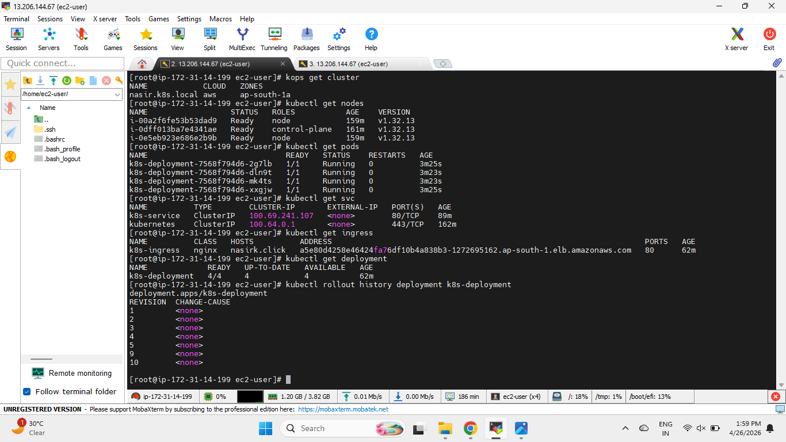

--------------------------------------------------
--------------------------------------------------

# Initial Deployment Setup

In this section, the initial version of the application is deployed into Kubernetes.

The deployment contains:

- Kubernetes Deployment
- ClusterIP Service
- NGINX Ingress
- Multiple Replicas
- Version 1 Application

--------------------------------------------------

## 1. Deployment Setup

This screenshot shows:

- Running pods
- ClusterIP service
- Ingress configuration
- Kubernetes deployment status

### Screenshot

```md
screenshots/deployment-setup.png
```

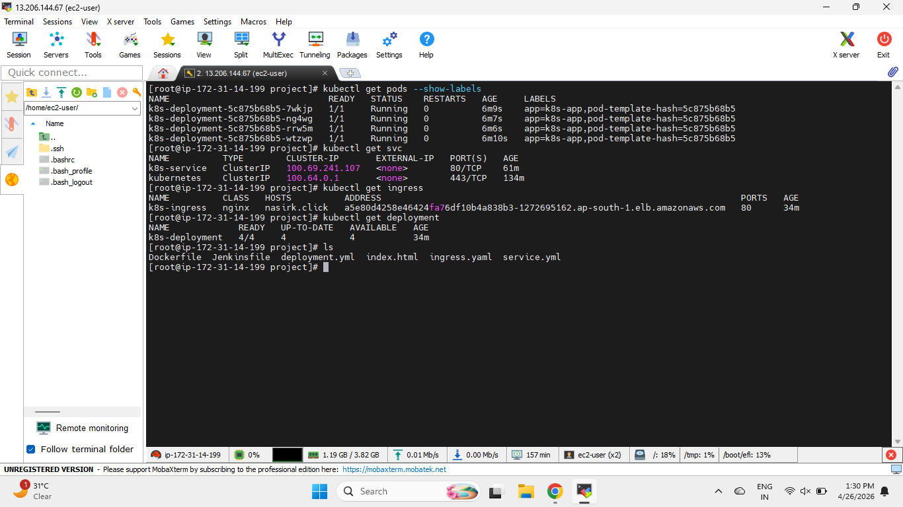

--------------------------------------------------

## 2. Initial Deployment Pipeline

This screenshot shows:

- Jenkins successful pipeline execution
- Automated CI/CD deployment process
- Successful deployment stages

### Screenshot

```md
screenshots/initial-deployment-pipeline.png
```

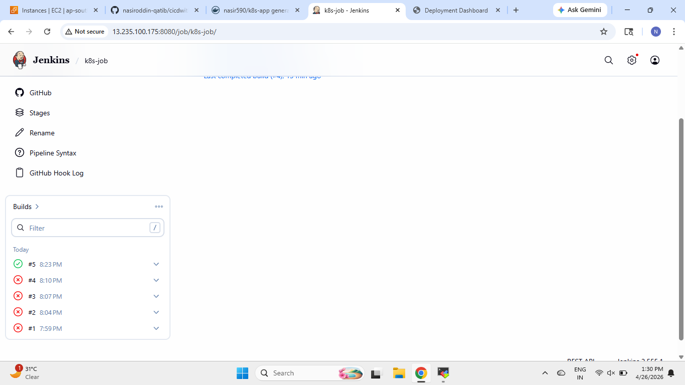

--------------------------------------------------

## 3. DockerHub Image for Version 1

This screenshot shows:

- Docker image pushed successfully
- Version tags
- Stable image strategy

### Screenshot

```md
screenshots/version1-image.png
```

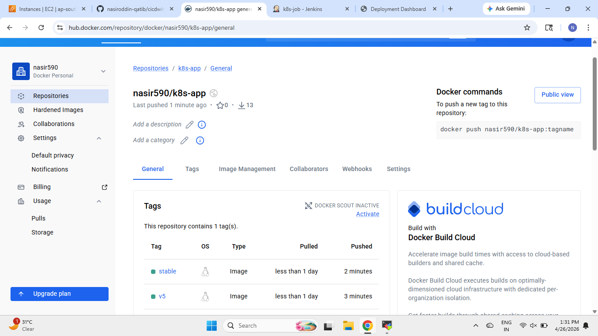

--------------------------------------------------

## 4. Application Successfully Running (Version 1)

The application is successfully accessible through Ingress.

Current Version:

```text
Version 1
```

### Screenshot

```md
screenshots/initial-deployment-v1.png
```

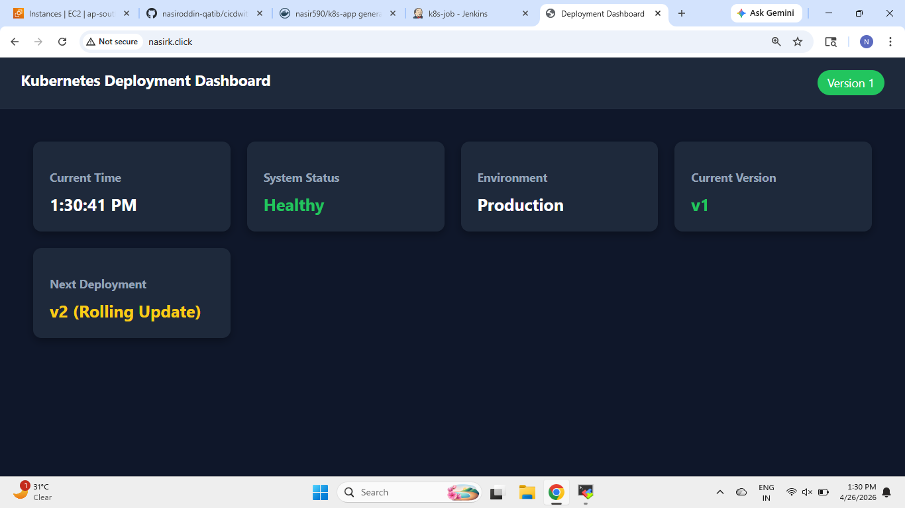

--------------------------------------------------
--------------------------------------------------

# Rolling Update to Version 2

In this section, the application is updated from:

```text
Version 1 → Version 2
```

Kubernetes performs a Rolling Update without downtime.

Kubernetes gradually creates new pods and deletes old pods one by one.

--------------------------------------------------

## 1. Jenkins Pipeline Triggered for Version 2

This screenshot shows:

- Jenkins pipeline execution
- Automated deployment update
- CI/CD process for new version

### Screenshot

```md
screenshots/version2-pipeline.png
```

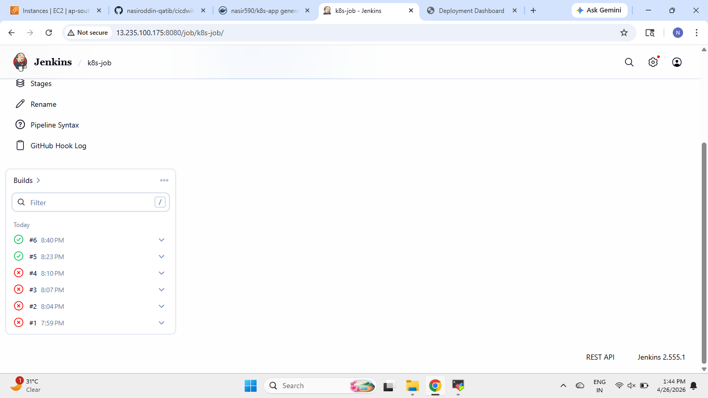

--------------------------------------------------

## 2. DockerHub Image Updated to Version 2

This screenshot shows:

- New Docker image pushed
- Version 2 image tag
- Updated application image

### Screenshot

```md
screenshots/version2-image.png
```

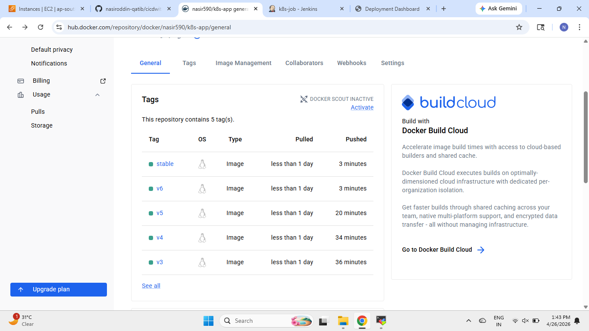

--------------------------------------------------

## 3. Rolling Update Process to Version 2

During Rolling Update:

- Kubernetes gradually creates new pods
- Kubernetes gradually deletes old pods
- Traffic continues without downtime

### Screenshot

```md
screenshots/updating-to-verion2.png
```

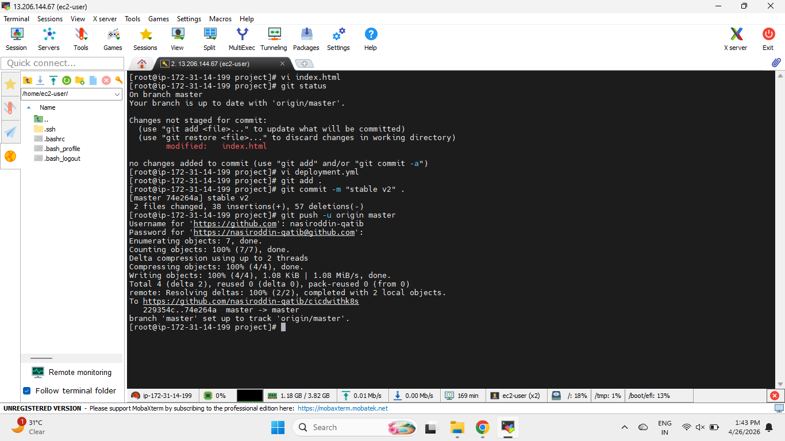

--------------------------------------------------
--------------------------------------------------

# Rolling Update to Version 3 (Stable Release)

In this section, the application is updated again to Version 3.

Version 3 becomes the final stable release.

--------------------------------------------------

## 1. Jenkins Pipeline Triggered for Version 3

This screenshot shows:

- Successful Jenkins build
- CI/CD execution
- Automated deployment pipeline

### Screenshot

```md
screenshots/version3-pipeline.png
```

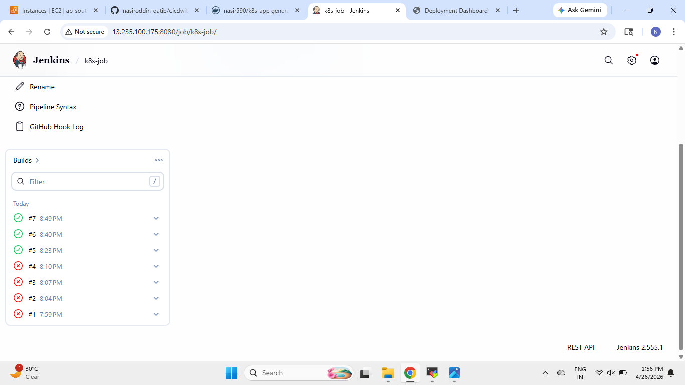

--------------------------------------------------

## 2. DockerHub Image Updated to Version 3

This screenshot shows:

- Version 3 image pushed
- Stable image tagging
- Updated DockerHub repository

### Screenshot

```md
screenshots/version3-image.png
```

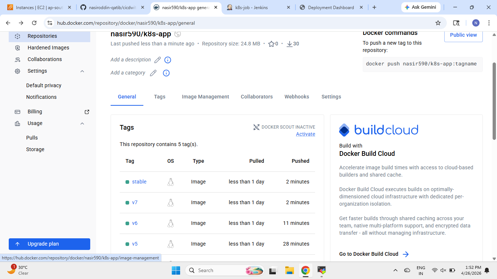

--------------------------------------------------

## 3. Rolling Update Process to Version 3

Kubernetes performs another Zero Downtime deployment.

Important Points:

- New pods created gradually
- Old pods removed gradually
- Users continue accessing application

### Screenshot

```md
screenshots/updating-to-version3.png
```

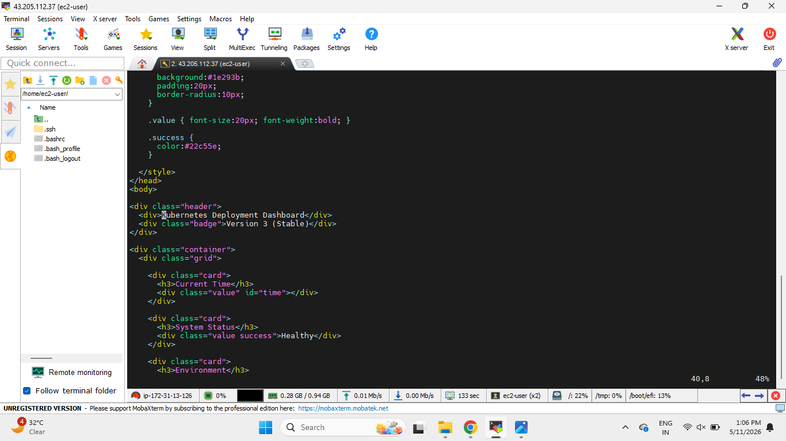

--------------------------------------------------

## 4. Final Stable Application Running Successfully

The final stable application version is successfully running.

Current Running Version:

```text
Version 3 (Stable)
```

### Screenshot

```md
screenshots/version3-deployment.png
```

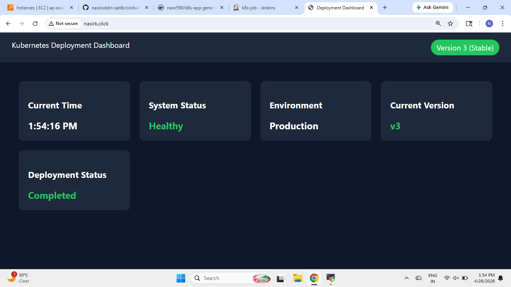

--------------------------------------------------
--------------------------------------------------

# Automatic Rollback Strategy

This project also includes Automatic Rollback logic inside the Jenkins Pipeline.

If deployment fails:

```text
Jenkins automatically executes:
kubectl rollout undo deployment k8s-deployment
```

This restores the previous stable Kubernetes deployment automatically.

Important Points:

- Rollback is automatic
- Previous stable version is restored
- Application availability remains protected
- Manual intervention is minimized

--------------------------------------------------

# Kubernetes Concepts Covered

- Deployment
- Pods
- ReplicaSets
- ClusterIP Service
- Ingress
- Rolling Updates
- CI/CD Pipeline
- Docker Image Versioning
- Rollout Verification
- Automatic Rollback
- Zero Downtime Deployment

--------------------------------------------------

# Commands Used

## Kubernetes Commands

```bash
kubectl get pods
kubectl get svc
kubectl get ingress
kubectl get deployment
kubectl rollout history deployment k8s-deployment
```

--------------------------------------------------

## Deployment Commands

```bash
kubectl apply -f deployment.yml
kubectl apply -f service.yml
kubectl apply -f ingress.yaml
```

--------------------------------------------------

## Rolling Update Command

```bash
kubectl set image deployment k8s-deployment k8s-app=nasir590/k8s-app:v2
```

--------------------------------------------------

## Rollback Command

```bash
kubectl rollout undo deployment k8s-deployment
```

--------------------------------------------------

# Conclusion

This project demonstrates a complete Production-Style Kubernetes CI/CD Pipeline using Jenkins and Docker.

The project successfully demonstrates:

- Automated CI/CD Deployment
- Kubernetes Rolling Updates
- Zero Downtime Deployment
- Docker Image Versioning
- Stable Release Strategy
- Automatic Rollback Support
- Production Deployment Architecture

Kubernetes ensures application availability during deployments by gradually creating new pods and deleting old pods one by one.

--------------------------------------------------

# Author

## Nasiroddin Khatib

- GitHub: https://github.com/nasiroddin-khatib
- LinkedIn: https://www.linkedin.com/in/nasiroddin-khatib-269841278/

--------------------------------------------------
